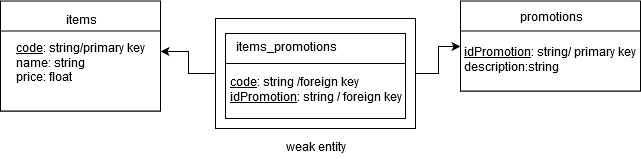

# shopping-cart

API that calculates the total amount to be pay from a sell.

## **Before start**

This API was made with didactic purposes. The databases don't contain sensitive information and are not open to everyone. If you want to use your own databases you can change this file ```config/config.json```

If you want to try it you can use postman. Just open ```Shopping-cart_postman_collection.json```. You need to authenticate, so I include a default user and password.

Take care of the scrips defined in the ```package.json```

Linux:

```javascript
"scripts": {
    "test": "export NODE_ENV=test && nyc mocha test/**/*.test.js --timeout 10000",
    "start": "export NODE_ENV=development && node index.js",
    ...
```

Windows:

```javascript
"scripts": {
    "test": "SET NODE_ENV=test && nyc mocha test/**/*.test.js --timeout 10000",
    "start": "SET NODE_ENV=development && node index.js",
    ...
```

## Items and prices

| Code        | Name    | Price   |
| ----------- |:-------:| ------: |
| PANTS       | Pants   | $5.00   |
| TSHIRT      | T-Shirt | $20.00  |
| HAT         | Hat     | $7.50   |

## Promotions

* **2-for-1**: buy two of the same product, get one free.
* **bulk purchases**: buying x or more of a product, the price of that product is reduced.

For now:

* Pants are 2-for-1.
* Buy 3 or more T-shirts and the price will be $19.00 per unit.

## Examples

Items: PANTS, TSHIRT, HAT \
Total: $32.50

Items: PANTS, TSHIRT, PANTS \
Total: $25.00

Items: TSHIRT, TSHIRT, TSHIRT, PANTS, TSHIRT \
Total: $81.00

Items: PANTS, TSHIRT, PANTS, PANTS, HAT, TSHIRT, TSHIRT \
Total: $74.50
___

## Database Diagram



### items_promotions

This is a weak entity that allows to us assign one item in several promotions and assign several items to one promotion.

### important to know

You can change **prices** and **items assign to promotions** without modify a single code line and the API will works. But if you want to add a new promotion, you must define the promotion behavior in ```app/modules/calculator.js```

Example:
```javascript
const promotionsLogic = {
    '2-for-1': (itemsCount, price) => {
        return Math.trunc(itemsCount / 2) * price;
    },
    'bulk': (itemsCount, price) => {
        return itemsCount >= 3 ?(price * 0.05) * itemsCount : 0;
    },
};
```
___


### To create a docker set up just use the next configuration.

Dockerfile

```
FROM node:8.11.1
RUN git clone https://github.com/KiviKong/shopping-cart.git
EXPOSE 8080
WORKDIR shopping-cart
RUN npm install
CMD ["npm", "start"]
```

docker-composer.yml

```
version: '2'

services:
  shopping-cart:
    build: .
    ports:
      - 8080:8080
    environment:
      - APP_PORT=8080
```

Build an run the API with Compose
```
docker-compose up
```

Stop the service
```
docker-compose stop
```

Removing the container entirely
```
docker-compose down
```